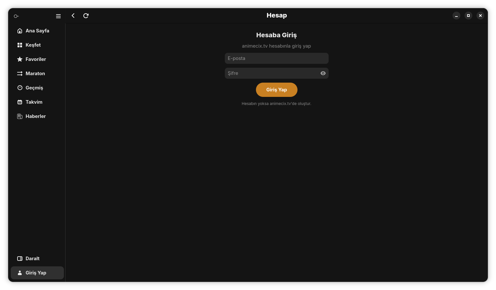

# AnimeciX

[](https://github.com/Lowell137/animecix-linux/releases/latest)
[](LICENSE)
 Bu Fork AI ile yapılmıştır


GTK4 ile yazılmış anime, dizi ve film istemcisi. Bu depo, orijinal projeden ayrılmış bir çataldır ve doğrudan buradan geliştirilir.

Bu çatala eklenenler:
- Ayarlar içinde sistem bağımlılık kontrolü: dağıtımı algılar, eksikleri tek komutla kurdurur
- Kart düzeni, hover davranışı ve oynatıcı başlatma düzeltmeleri


Tek dosyalık taşınabilir AppImage olarak dağıtılır. Açılışta yeni sürümü kontrol edip kendini güncelleyebilir. AppImage x86-64-v2 için derlenir, AVX512 gerektirmez.

> Resmî olmayan bir istemcidir, herkese açık API kullanır. Kendi sorumluluğunda kullan.

## Ekran görüntüleri

<div align="center">
| | |
|:---:|:---:|
|  |  |
| Ana Sayfa | Keşfet |
|  |  |
| Oynatıcı | Favoriler |
|  |  |
| Geçmiş | Maraton |
|  |  |
| Takvim | Haberler |
|  | |
| Giriş | |

## Kurulum

```bash
curl -L https://github.com/Lowell137/animecix-linux/releases/latest/download/AnimeciX-x86_64.AppImage -o AnimeciX.AppImage && chmod +x AnimeciX.AppImage && ./AnimeciX.AppImage
```

wget ile:

```bash
wget -O AnimeciX.AppImage https://github.com/Lowell137/animecix-linux/releases/latest/download/AnimeciX-x86_64.AppImage && chmod +x AnimeciX.AppImage && ./AnimeciX.AppImage
```

Kurulum gerekmez, tek dosyadır. Masaüstü kısayolu için uygulama içinden Ayarlar bölümündeki başlatıcı kurma seçeneğini kullan.

Video oynatmazsa önce Ayarlar içindeki Sistem Bağımlılıkları sayfasını aç. Dağıtımına göre eksik paketleri (mpv, gtk4, adwaita, gstreamer, ffmpeg) gösterir, tek düğmeyle terminal üzerinden kurdurur.

## Kaynaktan derleme

Gerekli paketler:

- Debian/Ubuntu: `sudo apt install libgtk-4-dev libadwaita-1-dev mpv pkg-config`
- Fedora: `sudo dnf install gtk4-devel libadwaita-devel mpv pkgconf-pkg-config`
- Arch: `sudo pacman -S gtk4 libadwaita mpv pkgconf`

Rust 1.74 ve üstü gerekir.

```bash
git clone https://github.com/Lowell137/animecix-linux.git
cd animecix-linux
cargo build --release
./target/release/animecix
```

Eski işlemcilerde `Illegal instruction` almamak için derlemeden önce hedefi sabitle:

```bash
export CFLAGS="-march=x86-64-v2 -O2"
export CXXFLAGS="-march=x86-64-v2 -O2"
export RUSTFLAGS="-C target-cpu=x86-64-v2"
```

`build_appimage.sh` bu değişkenleri kendisi ayarlar ve sürümü artırıp AppImage üretir. `GITHUB_TOKEN` tanımlıysa çıktıyı release olarak yükler:

```bash
export GITHUB_TOKEN=ghp_xxxxxxxx
bash build_appimage.sh
```

## Güncelleme

AppImage ile çalışıyorsa açılışta yeni sürümü kontrol eder. Ayarlar içindeki Otomatik Güncelleme açıksa onay sorup indirir, kurar ve yeniden başlatır. Dilersen aynı ekrandan elle denetleyebilirsin. Kaynaktan derlenen sürümde otomatik güncelleme kapalıdır.

## Kısayollar

| Kısayol | İşlev |
|---|---|
| `/` | Bölüm listesinde hızlı arama |
| `Ctrl+S` | Ana ekranda arama açma |
| `s` | İntro sonuna atlama |
| `e` | Outro sonuna atlama |
| `Esc` | Geri |

Kısayollar Ayarlar ekranından değişir.

## Veriler

Ayarlar, geçmiş ve kapak önbelleği burada tutulur:

```
~/.local/share/animecix/
~/.cache/animecix/
```

Ayarlar içindeki sıfırlama seçeneğiyle temizlenebilir.

## Lisans

[MIT](LICENSE)
