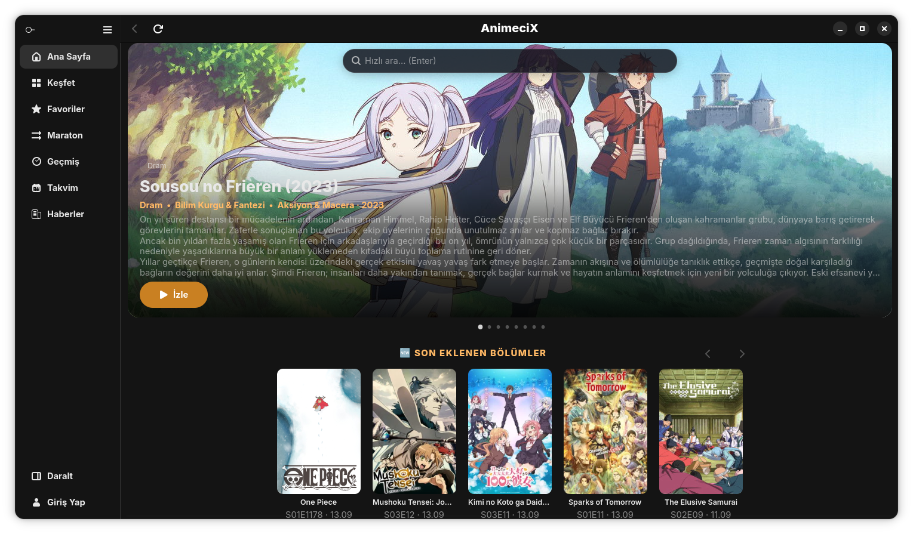
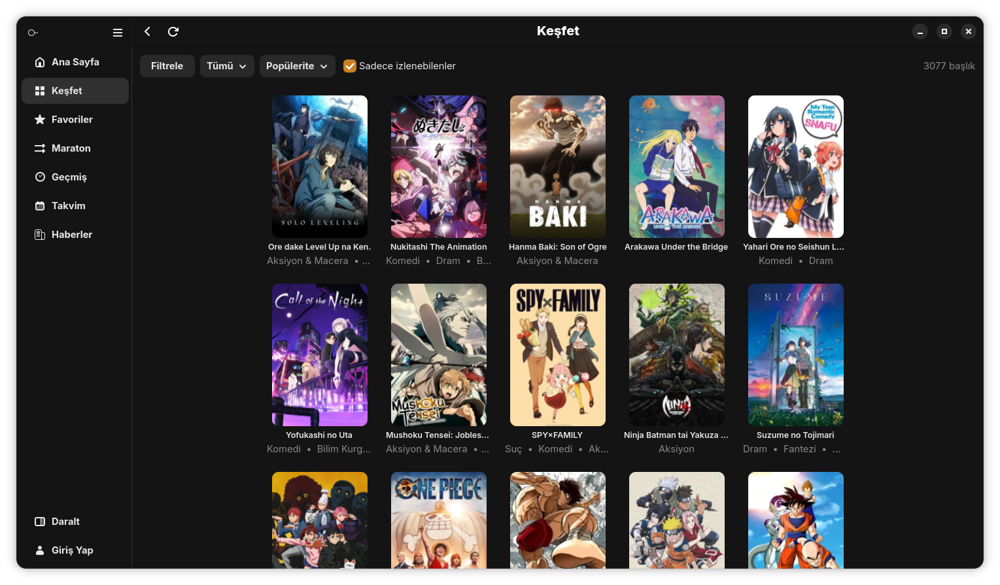
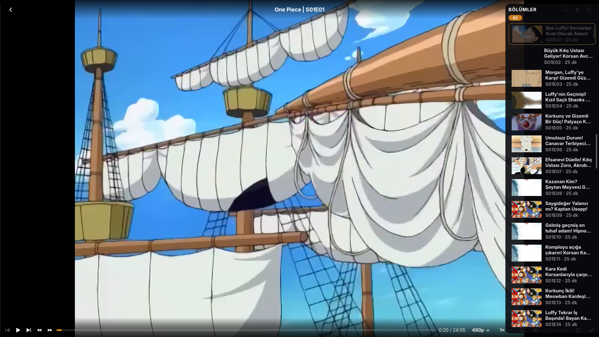
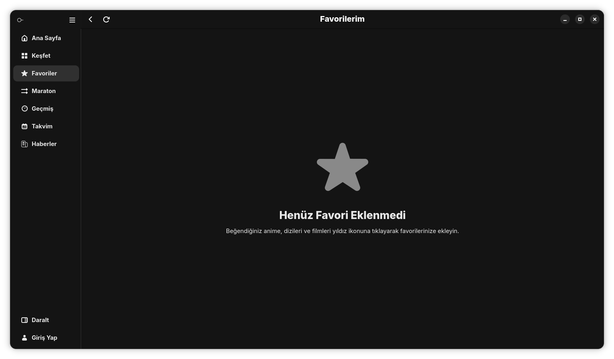
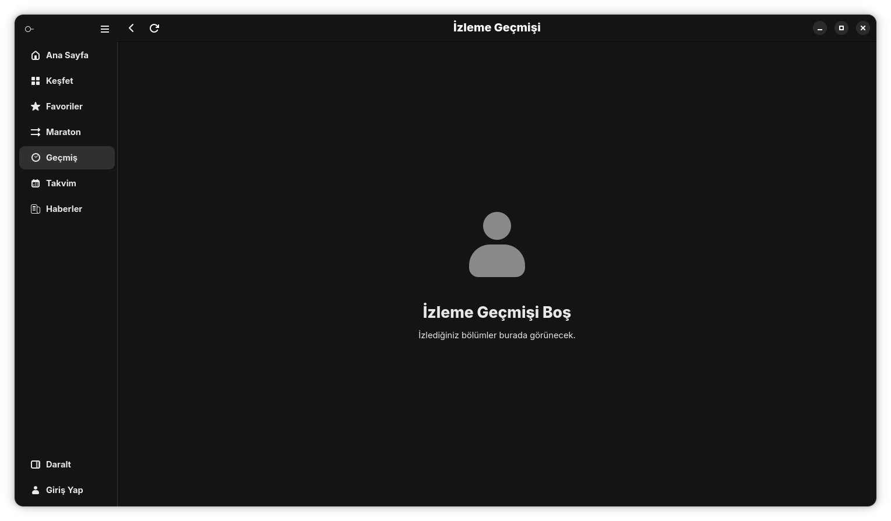
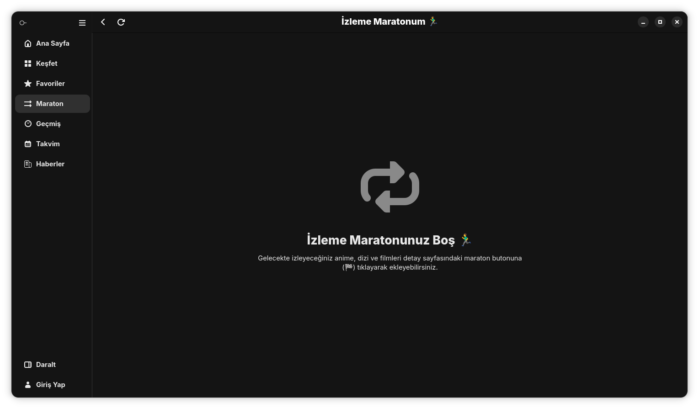
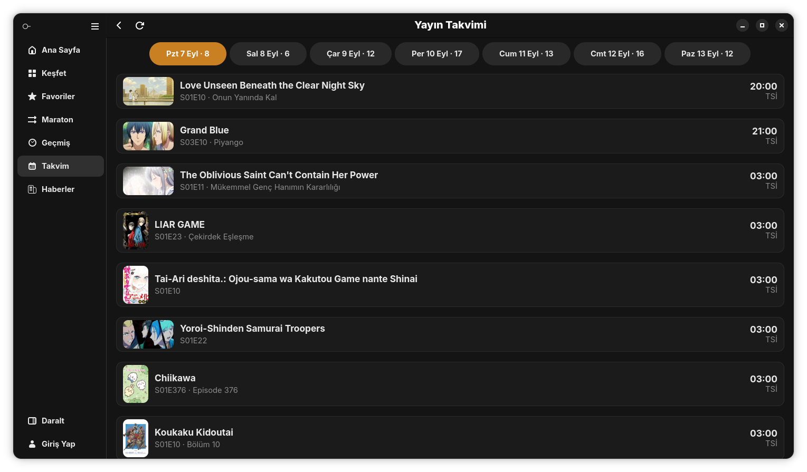
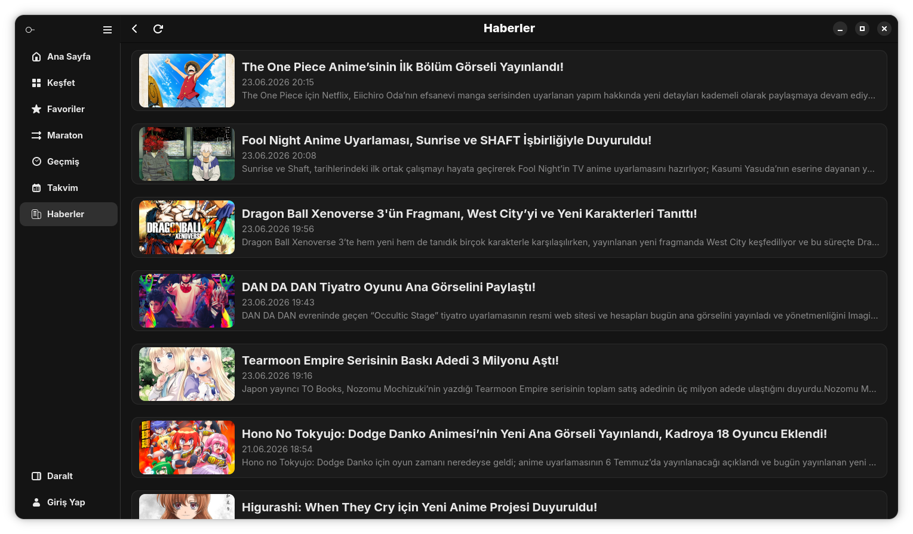

# AnimeciX

[](https://github.com/Lowell137/animecix-linux/releases/latest)
[](LICENSE)


Linux için modern, hafif ve hızlı Türkçe anime izleme istemcisi. GTK4 ve Libadwaita ile yerel masaüstü deneyimi sunar, video oynatımını gömülü `libmpv` motoru ile donanım hızlandırmalı olarak gerçekleştirir.

---

### Öne Çıkan Özellikler

- **Modern GTK4 / Libadwaita Arayüzü**: Sistem temasıyla tam uyumlu, akıcı ve şık arayüz.
- **Gömülü libmpv Oynatıcı**: Donanım hızlandırmalı, düşük kaynak tüketimli video motoru.
- **Focus Mod (Otomatik Atlama)**: AniSkip API entegrasyonu sayesinde açılış (OP) ve kapanış (ED) kısımlarını otomatik atlar; bölüm bitince sıradaki bölüme kesintisiz geçer.
- **Sade ve Sezgisel Kontroller**: Tıklayınca açılan ses kontrolü, tek dişli simgesi altında toplanan birleşik ayarlar (kaynak, kalite, hız, ses ve altyazı seçimi).
- **Takip & Düzenleme**: Favoriler, izleme geçmişi, maraton modu ve yayın takvimi.
- **İndirme Yöneticisi**: Çoklu bağlantı desteğiyle hızlı bölüm/film indirme ve indirme takibi.
- **Esnek Kurulum**: İster tek tıkla Flatpak, ister taşınabilir AppImage veya otomatik kurulum betiği.

---

## Ekran Görüntüleri

<div align="center">

| | |
|:---:|:---:|
|  |  |
| **Ana Sayfa** | **Keşfet & Arama** |
|  |  |
| **Oynatıcı** | **Favoriler** |
|  |  |
| **İzleme Geçmişi** | **Maraton Modu** |
|  |  |
| **Yayın Takvimi** | **Haberler** |

</div>

---

## Kurulum

### 1. Flatpak ile Kurulum (Önerilen - Tek Tıkla)
Bağımlılık ve sistem kütüphaneleriyle uğraşmadan tek tıkla kurmak için:

1. [Sürümler](https://github.com/Lowell137/animecix-linux/releases/latest) sayfasından **`AnimeciX.flatpak`** dosyasını indirin.
2. Dosyaya çift tıklayarak GNOME Yazılımlar mağazasından kurun veya terminalden çalıştırın:
```bash
flatpak install --user AnimeciX.flatpak
flatpak run io.github.Lowell137.AnimeciX
```

### 2. Tek Komutla Otomatik Kurulum
Fedora, Ubuntu, Debian, Arch ve openSUSE üzerinde eksik bağımlılıkları (`mpv-libs`, `fuse` vb.) otomatik kurup uygulamayı başlatır:

```bash
curl -fsSL https://raw.githubusercontent.com/Lowell137/animecix-linux/main/scripts/install.sh | bash
```

### 3. Taşınabilir AppImage

```bash
curl -L https://github.com/Lowell137/animecix-linux/releases/latest/download/AnimeciX-x86_64.AppImage -o AnimeciX.AppImage && chmod +x AnimeciX.AppImage && ./AnimeciX.AppImage
```

*(Fedora veya modern Ubuntu'da FUSE uyarısı alırsanız `./AnimeciX.AppImage --appimage-extract-and-run` parametresiyle açabilirsiniz).*

---

## Kısayollar

| Kısayol | İşlev |
|---|---|
| `Boşluk` / `k` | Oynat / Duraklat |
| `f` | Tam ekran aç / kapat |
| `s` | İntro (OP) sonuna atla |
| `e` | Outro (ED) sonuna atla |
| `m` | Sesi kapat / aç (Mute) |
| `Yukarı / Aşağı` | Ses seviyesi artır / azalt |
| `Sağ / Sol` | 5 saniye ileri / geri sar |
| `Esc` | Geri dön / tam ekrandan çık |
| `Ctrl+S` | Ana ekranda arama kutusunu aç |
| `/` | Bölüm listesinde hızlı filtrele |

---

## Kaynaktan Derleme

Gerekli sistem paketleri:
- **Debian / Ubuntu**: `sudo apt install libgtk-4-dev libadwaita-1-dev libmpv-dev pkg-config`
- **Fedora**: `sudo dnf install gtk4-devel libadwaita-devel mpv-libs-devel pkgconf-pkg-config`
- **Arch Linux**: `sudo pacman -S gtk4 libadwaita mpv pkgconf`

Derleme:
```bash
git clone https://github.com/Lowell137/animecix-linux.git
cd animecix-linux
cargo build --release
./target/release/animecix
```

---

## Veri Konumları

Ayarlar, izleme geçmişi ve kapak önbelleği:
```
~/.local/share/animecix/
~/.cache/animecix/
```

---

## Lisans

Bu proje [MIT Lisansı](LICENSE) altında dağıtılmaktadır.
